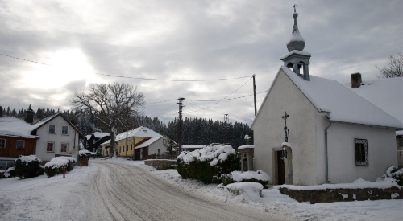

---
# Feel free to add content and custom Front Matter to this file.
# To modify the layout, see https://jekyllrb.com/docs/themes/#overriding-theme-defaults

layout: home
---

Svojše je malá vesnička v centrální části Šumavy. Leží v nadmořské výšce 795 m.n.m na hřbetu na levém břehu Rýžovnického potoka

Vesnicí prochází silnice silnice II/168 z Rejštejna na Horskou Kvildu.

První zmínky o vesnici pocházejí z roku 1584. Až do roku 1850 tvořily Svojše (Zwoischen) jeden správní celek s osadami Kozí Hřbety a Horská Kvilda.

Většina obyvatel byla německého původu a po druhé světové válce byla odsunuta.
